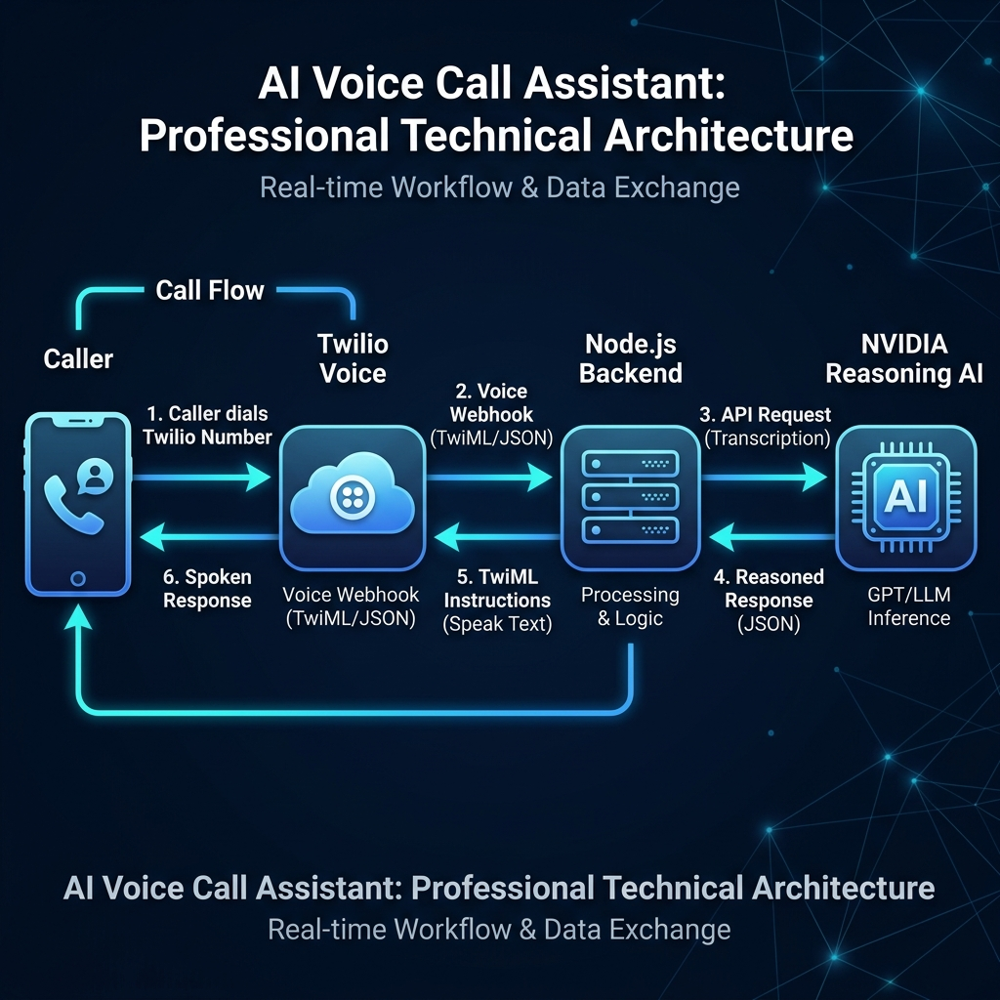
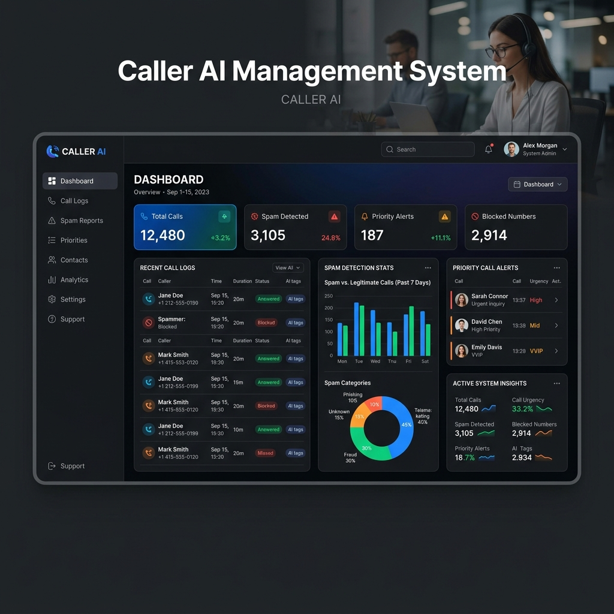

# 📞 Caller AI Agent (NVIDIA + Twilio)

An intelligent, reasoning-capable AI voice assistant that handles your phone calls professionally. Powered by **NVIDIA's Reasoning Models** and **Twilio Voice**, this assistant can detect intent, handle inquiries, filter spam, and escalate urgent matters.


---

## 💡 About the Agent

The **Caller AI Agent** is designed to act as a professional first point of contact for personal or business phone numbers. Unlike traditional IVR systems, this agent uses **Large Language Models (LLMs)** with advanced reasoning capabilities to understand natural language, remember context, and make intelligent decisions in real-time.

### Key Capabilities:
- **Intelligent Screening**: Automatically identifies and filters unsolicited sales or spam calls.
- **Priority Detection**: Recognizes emergencies or urgent matters and prepares them for immediate escalation.
- **Natural Interaction**: Uses Neural text-to-speech for a warm, human-like voice.
- **Smart Actions**: Triggers backend logic like call transfers, message recording, and callback scheduling.

---

## 🔄 How It Works (Workflow)

The agent follows a sophisticated loop of transcription, reasoning, and speech synthesis to provide a seamless caller experience.



### The 4-Step Cycle:
1.  **Ingestion**: A caller dials your Twilio number. Twilio answers and captures the audio.
2.  **Transcription**: Twilio's Speech-to-Text (STT) engine converts the audio into text in real-time.
3.  **Reasoning**: The text is sent to the **NVIDIA AI** (e.g., GPT-OSS-20B). The model reviews your `system_prompt.txt` and the conversation history to formulate the perfect response.
4.  **Execution**: The backend receives the AI's response and sends TwiML instructions back to Twilio to speak the response using a Neural voice and then listen for the next input.

---

## 📊 Analytics and Insights

Keep track of your calls with integrated logging and classification. The system automatically categorizes calls into Priority, General, and Spam.



---

## 📂 Project Structure

```text
callerAIAgent/
├── assets/            # Project images and diagrams
├── index.js           # Core server logic (Express + OpenAI Client)
├── system_prompt.txt  # The "Brain": AI personality and instructions
├── .env               # Secrets & Configuration (NVIDIA API Key)
├── package.json       # Dependencies and scripts
└── README.md          # Complete documentation and workflow
```

- **`index.js`**: Manages the HTTP routes for Twilio and the communication with NVIDIA's API. It handles the turn-based logic of the call.
- **`system_prompt.txt`**: This is where you define the agent's identity. You can change how it handles calls just by editing this text file—no code changes required.

---

## 🚀 Quick Start (Local Development)

### 1. Prerequisites
- **Node.js** (v18+)
- **Twilio Account**: A phone number with Voice capabilities.
- **NVIDIA API Key**: Access to reasoning models via NVIDIA's API catalog.
- **ngrok**: To expose your local server to Twilio.

### 2. Installation
```bash
npm install
```

### 3. Environment Setup
Create a `.env` file and fill in your credentials:
```env
PORT=3000
NVIDIA_API_KEY=your_nvidia_api_key_here
USER_NAME="Amit"
```

### 4. Run the Server
```bash
node index.js
```

---

## 🛠️ Production Deployment

### 1. Webhook Configuration
In the [Twilio Console](https://console.twilio.com/), set your number's **Incoming Call Webhook** to:
`https://your-domain.com/incoming-call`

### 2. Hosting
Deploy to **Render**, **Railway**, or **AWS**. Ensure your environment variables (`NVIDIA_API_KEY`) are properly configured in the hosting dashboard.

### 3. Process Manager
Use **PM2** to ensure 24/7 uptime:
```bash
pm2 start index.js --name "caller-ai"
```

---

## 📄 License
MIT
